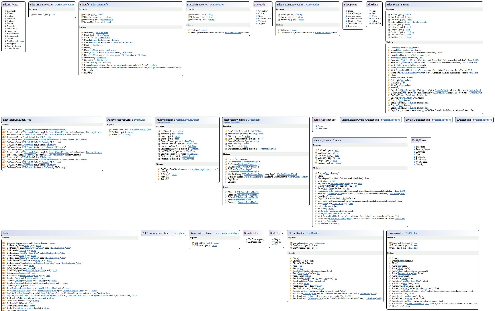

# .NET Object Model Diagram Generator

A cross-platform Roslyn-based tool that generates an object model diagram of a set of C# source files 

### Usage:
```
dotnet GENERATOR.dll /source=[source folder] /compareSource=[oldSourceFolder] /preprocessors=[defines] /format=[html|image] /ShowPrivate /ShowInternal

Required parameters:
  source        Specifies the folder of source files to include for the object model.
                Separate with ; for multiple folders

Optional parameters:
  compareSource Specifies a folder to compare source and generate a diff model
                This can be useful for finding API changes or compare branches
  format        Format to generate: 
                   'html' a single html output (html is default)
                   'md' for markdown you can copy-paste to for instance GitHub
  preprocessors Define a set of preprocessors values. Use ; to separate multiple
  exclude       Defines one or more strings that can't be part of the path Ie '*/Samples/*;*/UnitTests/*'
                (use forward slash for folder separators)
  regexfilter   Defines a regular expression for filtering on full file names in the source
  ShowPrivate   Show private members (default is false)
  ShowInternal  Show internal members (default is false)
```

### NuGet
As an alternative you can also reference a [NuGet package](https://www.nuget.org/packages/dotMorten.OmdGenerator/) to your class library, and an Object Model Diagram HTML file will be auto-generated when you build your project:

```
Install-Package dotMorten.OmdGenerator 
```

An example of a generated output for all of .NET Core can be found [here](http://www.sharpgis.net/Tests/corefx.html).

It can also be used to compare two folders (for instance two separate branches) and only show changes to the API. [Here's an example of .NET CoreFX v2.0 vs Master](http://www.sharpgis.net/Tests/corefx_new.html).

[](http://www.sharpgis.net/Tests/corefx.html)


### Examples

Generate OMD for .NET Core FX source code, and ignore ref and test folders:
```
dotnet Generator.dll /source=c:\github\dotnet\corefx\src /exclude="*/ref/*;*/tests/*;*/perftests/*"
```

Compare .NET CoreFX Master with v2.0.0 repo branches directly from their Github zipped downloads:

```
dotnet Generator.dll /source=https://github.com/dotnet/corefx/archive/master.zip /compareSource=https://github.com/dotnet/corefx/archive/release/2.0.0.zip /exclude="*/ref/*;*/tests/*;*/perftests/*"
```


